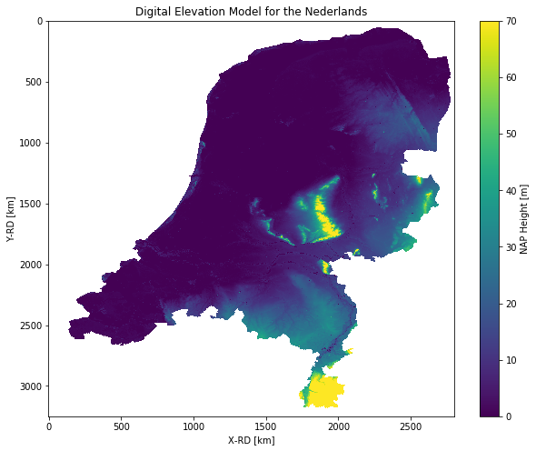
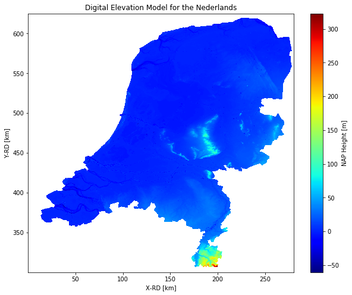
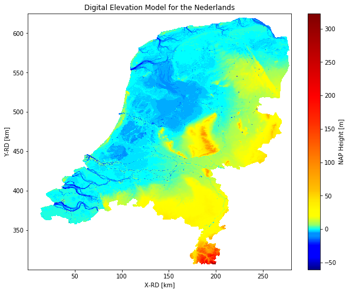
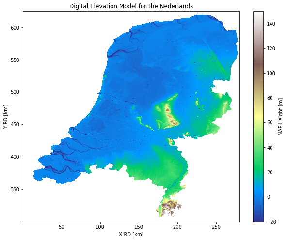

## Script to plot AHN with 100 m resolution (part 1)


```
# Importing the libraries
import netCDF4 as nc
import matplotlib.pyplot as plt
```


```
# Read the data
grid = nc.Dataset('mv100.nc')
z = grid.variables['depth'][:]
```


```
# Plot using imshow
fig, ax = plt.subplots(1, 1, figsize=(10, 8))
plt.imshow(z[:].T)
plt.colorbar(label='NAP Height [m]')
ax.axis('equal')
ax.axis('tight')
plt.title('Digital Elevation Model for the Nederlands')
plt.xlabel('X-RD [km]')
plt.ylabel('Y-RD [km]')
plt.clim(0,70)  
```





```
# Plot using matplotlib.pcolormesh
x = grid.variables['x']
y = grid.variables['y']
z = grid.variables['depth']

fig, ax = plt.subplots(1, 1, figsize=(10, 8))
cmap = plt.get_cmap('jet')
plt.pcolormesh(x[:] / 1000, y[:] / 1000, z[:].T, cmap=cmap)
plt.colorbar(label='NAP Height [m]')
ax.axis('equal')
ax.axis('tight')
plt.title('Digital Elevation Model for the Nederlands')
plt.xlabel('X-RD [km]')
plt.ylabel('Y-RD [km]')
```


    Text(0, 0.5, 'Y-RD [km]')





```
# Plot histogram

def histc(X, bins):
    map_to_bins = np.digitize(X, bins)
    r = np.zeros(bins.shape)
    for i in map_to_bins:
        r[i - 1] += 1
    return [r, map_to_bins]

b = np.arange(-61,324,1)
h = histc(z[:], b)
# print(h)
# plt.figure();
# plt.bar(b, h)
```


```
# Using scipy to load mat file
from scipy.io import loadmat
from matplotlib.colors import ListedColormap
bathymap = loadmat('bathymap.mat')
bathymap = bathymap['bathymap']
```


```
# Plot using matplotlib.pcolormesh
x = grid.variables['x']
y = grid.variables['y']
z = grid.variables['depth']

fig, ax = plt.subplots(1, 1, figsize=(10, 8))
cmap = ListedColormap(bathymap)
plt.pcolormesh(x[:] / 1000, y[:] / 1000, z[:].T, cmap=cmap)
plt.colorbar(label='NAP Height [m]')
ax.axis('equal')
ax.axis('tight')
plt.title('Digital Elevation Model for the Nederlands')
plt.xlabel('X-RD [km]')
plt.ylabel('Y-RD [km]')
```


    Text(0, 0.5, 'Y-RD [km]')





```
# Plot using matplotlib.pcolormesh
x = grid.variables['x']
y = grid.variables['y']
z = grid.variables['depth']

fig, ax = plt.subplots(1, 1, figsize=(10, 8))
cmap = plt.get_cmap('terrain')
plt.pcolormesh(x[:] / 1000, y[:] / 1000, z[:].T, cmap=cmap)
plt.colorbar(label='NAP Height [m]')
ax.axis('equal')
ax.axis('tight')
plt.title('Digital Elevation Model for the Nederlands')
plt.xlabel('X-RD [km]')
plt.ylabel('Y-RD [km]')
plt.clim(-20,150)  
```




